# Task Request

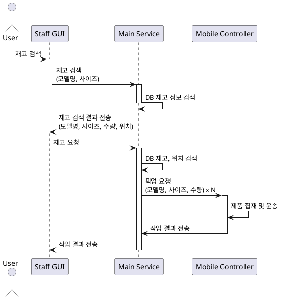


# Staff PC

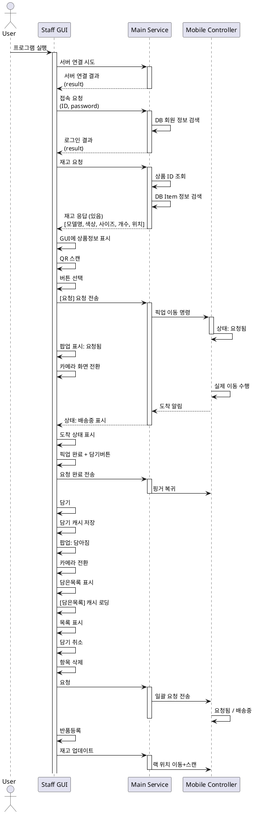


## Login Flow

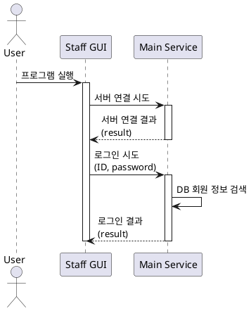


## 재고 요청 Flow

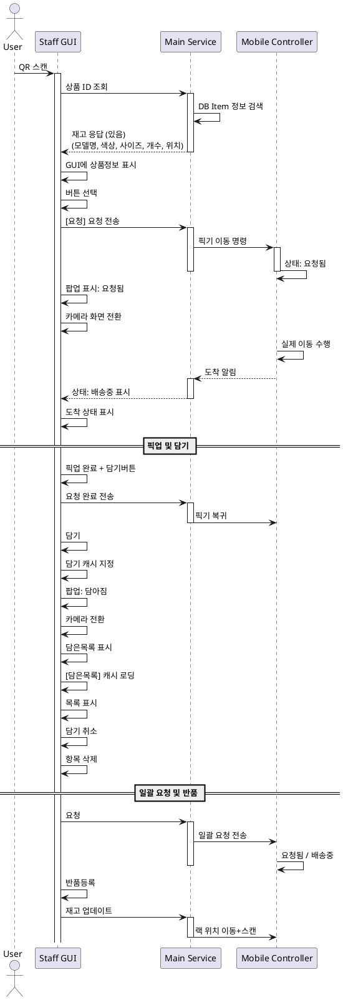


# Manager PC

## Log 확인

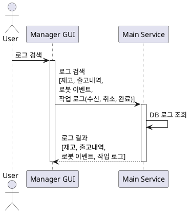


### 재고 정보 확인

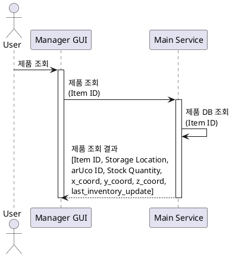


### 로봇 이벤트 조회

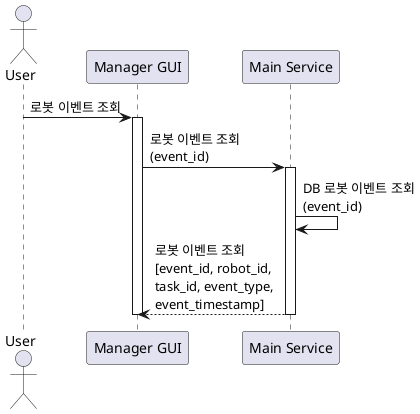


### 작업 로그 확인

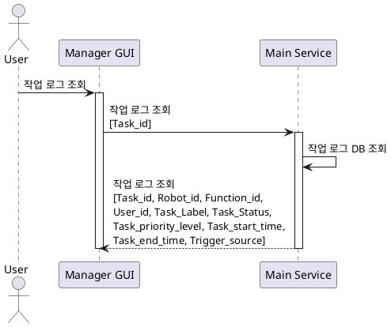


## 로봇 동작 상태 확인

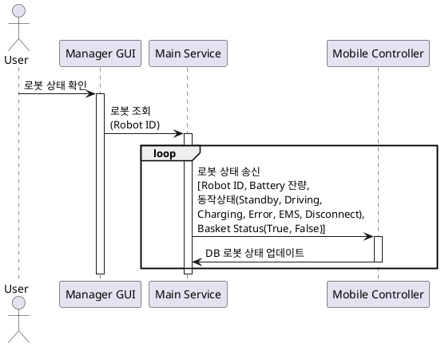


## 로봇 등록 삭제

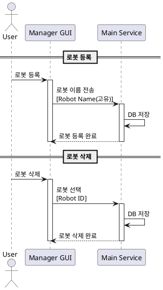


## Robot Location

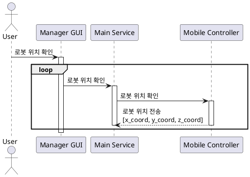


## 재고 파악 모드

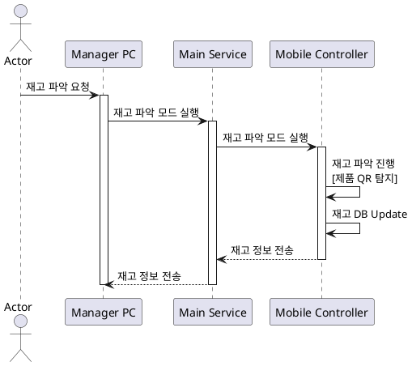

# Main Service

## Task Controller Flow

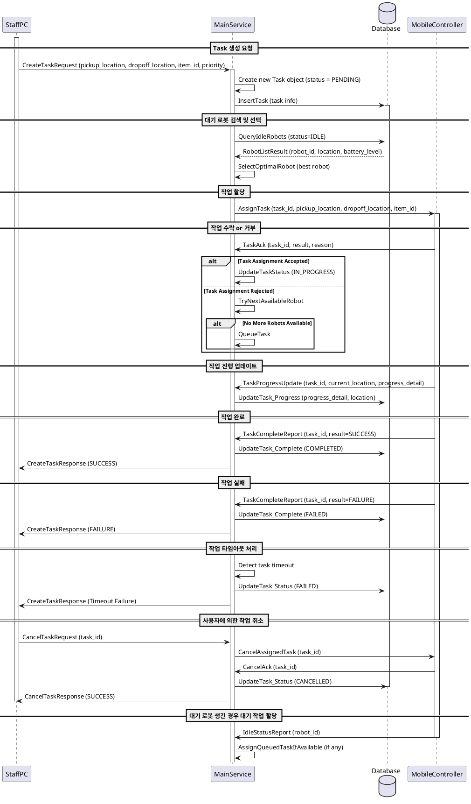

## Received Request and Respond to Staff GUI

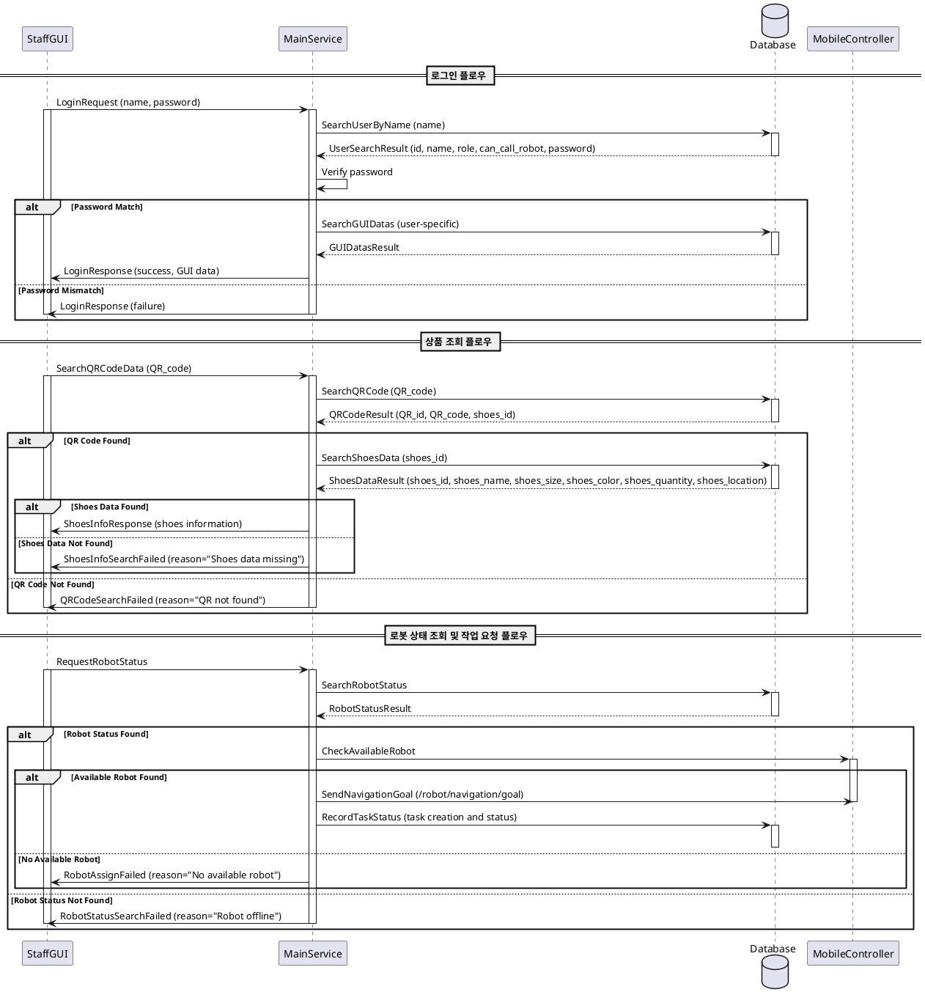

## Received Request and Respond to Manager GUI

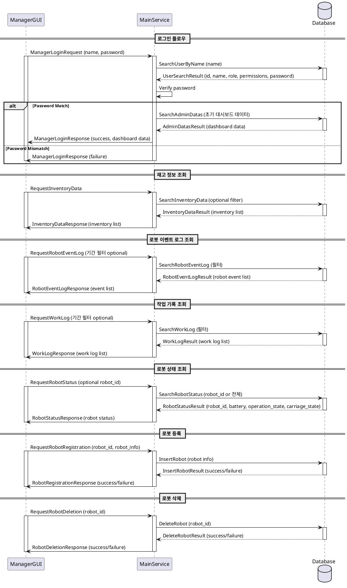

## Handle Received Data From Object Detector

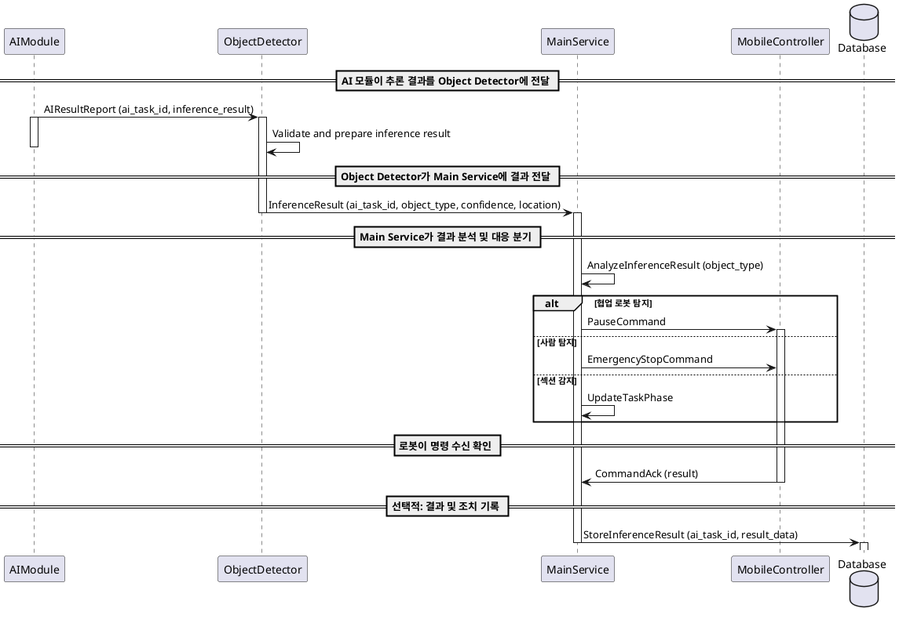

## Handle Received Data From Mobile Controller

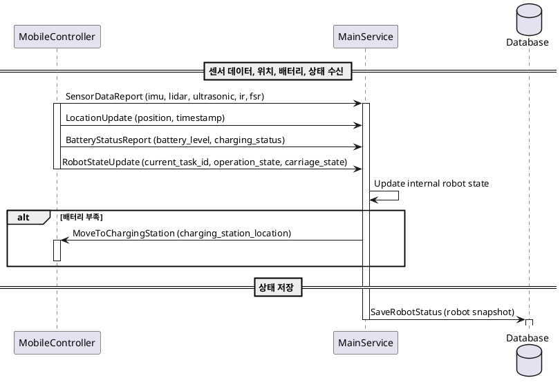

## Received Request and Respond to Mobile Controller

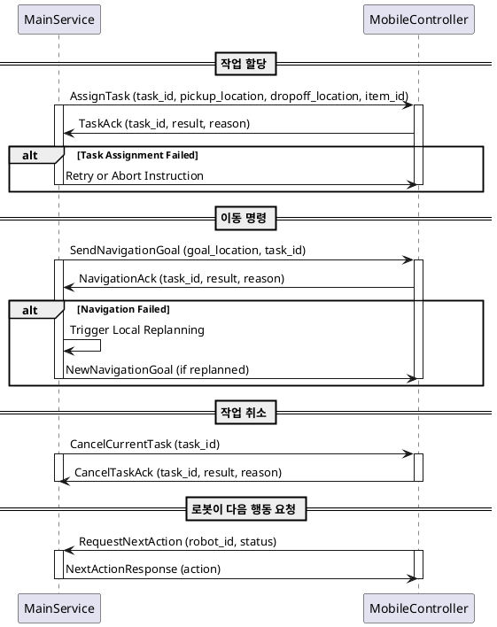

# Mobile Controller

## Sensor data collection and state transfer flow

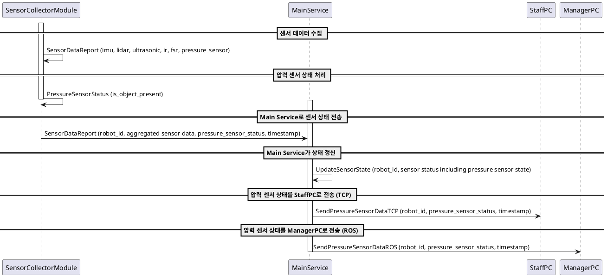

## Battery flow

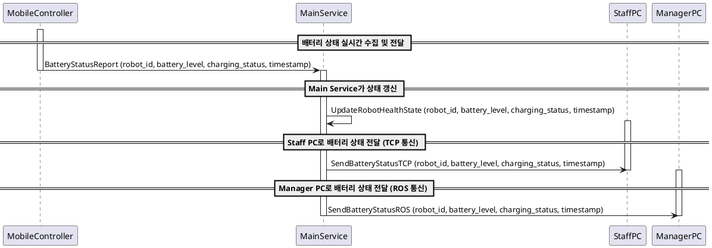

## Video Sender(Camera video capture and AI Server send flow)

```plantuml
@startuml
participant VideoSenderModule
participant AIServer_ObjectDetector
participant MainService

== 카메라에서 영상 프레임 캡처 ==

activate VideoSenderModule
VideoSenderModule -> VideoSenderModule: CapturedFrame (frame, timestamp)
VideoSenderModule -> VideoSenderModule: EncodeFrame (compression/formatting)

== AI Server로 프레임 전송 (robot_id 추가) ==

activate AIServer_ObjectDetector
VideoSenderModule -> AIServer_ObjectDetector: MediaFrame (encoded frame, metadata, robot_id)
AIServer_ObjectDetector -> AIServer_ObjectDetector: ReceiveFrame (handle incoming frame, robot_id)
deactivate VideoSenderModule

== ObjectDetector 결과를 MainService로 전송 ==

activate MainService
AIServer_ObjectDetector -> MainService: DetectionResult (robot_id, detected_objects, timestamp)
deactivate MainService

@enduml
```

## Command Reception and Motor/Actuator Control Flow

```plantuml
@startuml
participant MainService
participant MobileController_StateManager
participant MotorController
participant ManagerPC
participant StaffPC

== Main Service가 이동 명령 전송 ==

activate MainService
MainService -> MobileController_StateManager: MovementCommand (move/stop/rotate, target_location, shortest_path)
deactivate MainService

activate MobileController_StateManager
MobileController_StateManager -> MotorController: ExecuteMovementCommand (parsed command)
deactivate MobileController_StateManager

activate MotorController
MotorController -> MotorController: DriveMotor (speed, direction)

== 물체 감지 및 회피 명령 조건 체크 ==

loop 물체 감지 및 회피
    MotorController -> MobileController_StateManager: ObstacleDetected (distance_to_object)
    
    activate MobileController_StateManager
    MobileController_StateManager -> MainService: ObstacleAlert (distance_to_object, obstacle_position)
    deactivate MobileController_StateManager
    
    MotorController -> MotorController: (waiting for avoidance command)

    activate MainService
    MainService -> MobileController_StateManager: AvoidanceCommand (rotate_direction)
    deactivate MainService

    activate MobileController_StateManager
    MobileController_StateManager -> MotorController: ExecuteAvoidanceCommand (rotate_direction)
    deactivate MobileController_StateManager

    MotorController -> MotorController: DriveMotor (rotate to avoid obstacle)
end loop

== 이동 완료 or 실패 보고 ==

MotorController -> MobileController_StateManager: MovementFeedback (execution_result, current_position)

activate MobileController_StateManager
MobileController_StateManager -> MainService: CommandAck (success/failure)
deactivate MobileController_StateManager

alt 이동 실패
  activate MainService
  MainService -> ManagerPC: SendErrorReport (error_details, timestamp)
  MainService -> StaffPC: SendErrorReport (error_details, timestamp)
  
  MainService -> MobileController_StateManager: RetryMovementCommand (retry_command)
  deactivate MainService
end alt

== 정밀 정차 명령 처리 ==

activate MainService
MainService -> MobileController_StateManager: PreciseParkingCommand (target_location, tolerance ±5cm)
deactivate MainService

activate MobileController_StateManager
MobileController_StateManager -> MotorController: ExecutePreciseParking (target_location, tolerance ±5cm)
deactivate MobileController_StateManager

MotorController -> MotorController: FineAdjustPosition (within ±5cm)

MotorController -> MobileController_StateManager: ParkingFeedback (success/failure)

activate MobileController_StateManager
MobileController_StateManager -> MainService: ParkingAck (success/failure)
deactivate MobileController_StateManager

== 배터리 상태 모니터링 및 충전 명령 ==
loop 배터리 잔량 실시간 체크
    MotorController -> MobileController_StateManager: BatteryStatusReport (battery_level)

  activate MobileController_StateManager
  MobileController_StateManager -> MainService: BatteryStatusUpdate (battery_level)
  deactivate MobileController_StateManager

  activate MainService
  MainService -> MobileController_StateManager: ChargingCommand (charging_station_location)
  deactivate MainService
end loop

alt 배터리 잔량 <= 20
  activate MobileController_StateManager
  MobileController_StateManager -> MotorController: MoveToChargingStation (charging_station_location)
  deactivate MobileController_StateManager

  MotorController -> MotorController: DriveMotor (move to charging station)

  MotorController -> MobileController_StateManager: ChargingArrivalFeedback (arrival_status)
end alt

activate MobileController_StateManager
MobileController_StateManager -> MainService: ChargingArrivalAck (success/failure)
deactivate MobileController_StateManager

== Task 취소 요청 처리 ==
alt Task 취소 요청 받음
  activate MainService
  MainService -> MobileController_StateManager: CancelTaskRequest (when cart_state == 0)
  deactivate MainService

  activate MobileController_StateManager
  MobileController_StateManager -> MotorController: SetStateToStandby()
  MobileController_StateManager -> MainService: CancelAck (standby mode entered)
  MotorController -> MotorController: DriveMotor (speed, direction)
  deactivate MobileController_StateManager
  deactivate MotorController
end alt

@enduml
```


# AI Server

```plantuml
@startuml
participant "Video Sender" as Video
participant "File System" as File
participant "Object Detecter" as Detector
participant "AI Module" as AI
participant "Main Service" as Main

Video -> File : UDP stream media data
activate File
File -> File : write data to file path
File -> Detector : send media file path
deactivate File

activate Detector
Detector -> Detector : detect object in media
Detector -> AI : dispatch detected objects\nto AI modules
deactivate Detector

activate AI
AI -> AI : run interface on data
AI -> Main : send interface
deactivate AI

activate Main
Main -> Main : save interface to database
deactivate Main
@enduml
```

## Object Detecter

```plantuml
@startuml
participant MobileController
participant ObjectDetector
participant AIModule
participant MainService
database FileSystem

== 로봇에서 미디어 프레임 수신 ==

activate MobileController
MobileController -> ObjectDetector: MediaFrame (image frame, metadata)
deactivate MobileController

== 미디어 저장 ==

activate ObjectDetector
activate FileSystem
ObjectDetector -> FileSystem: SaveFrame (save image file)
deactivate FileSystem

== AI 모듈에 분석 요청 ==


ObjectDetector -> AIModule: AnalyzeFrame (image file path)


== AI 모듈이 분석 결과 반환 ==

activate AIModule
AIModule -> ObjectDetector: AIResultReport (ai_task_id, inference_result)
deactivate AIModule

== 결과 검증 및 정리 ==

ObjectDetector -> ObjectDetector: Validate and prepare inference result

== Main Service에 결과 전달 ==

activate MainService
ObjectDetector -> MainService: InferenceResult (ai_task_id, object_type, confidence, location)
deactivate ObjectDetector
deactivate MainService


@enduml
```