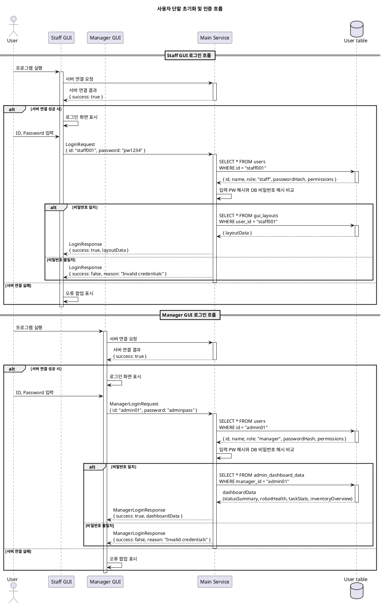
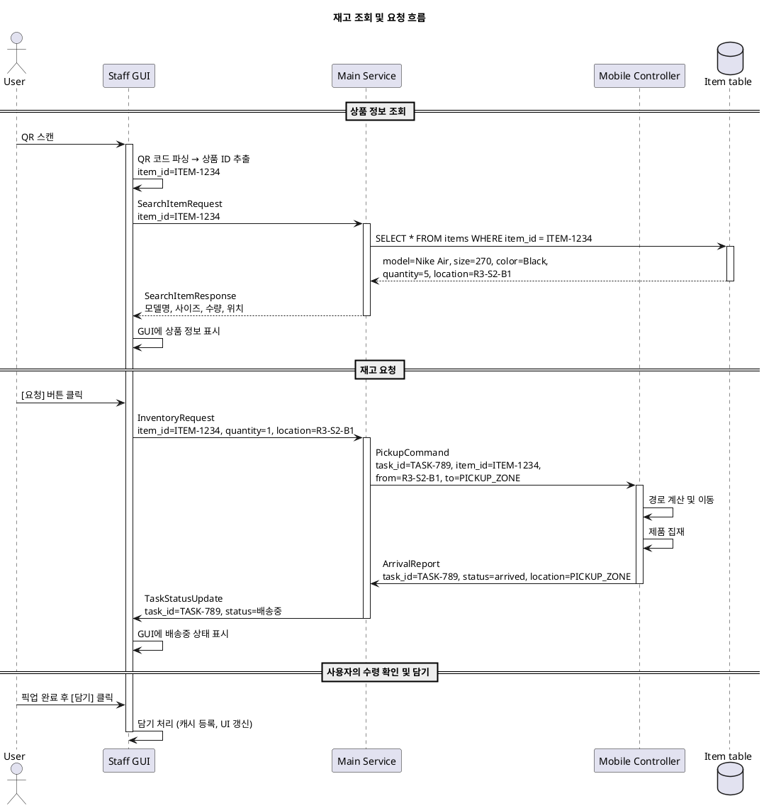
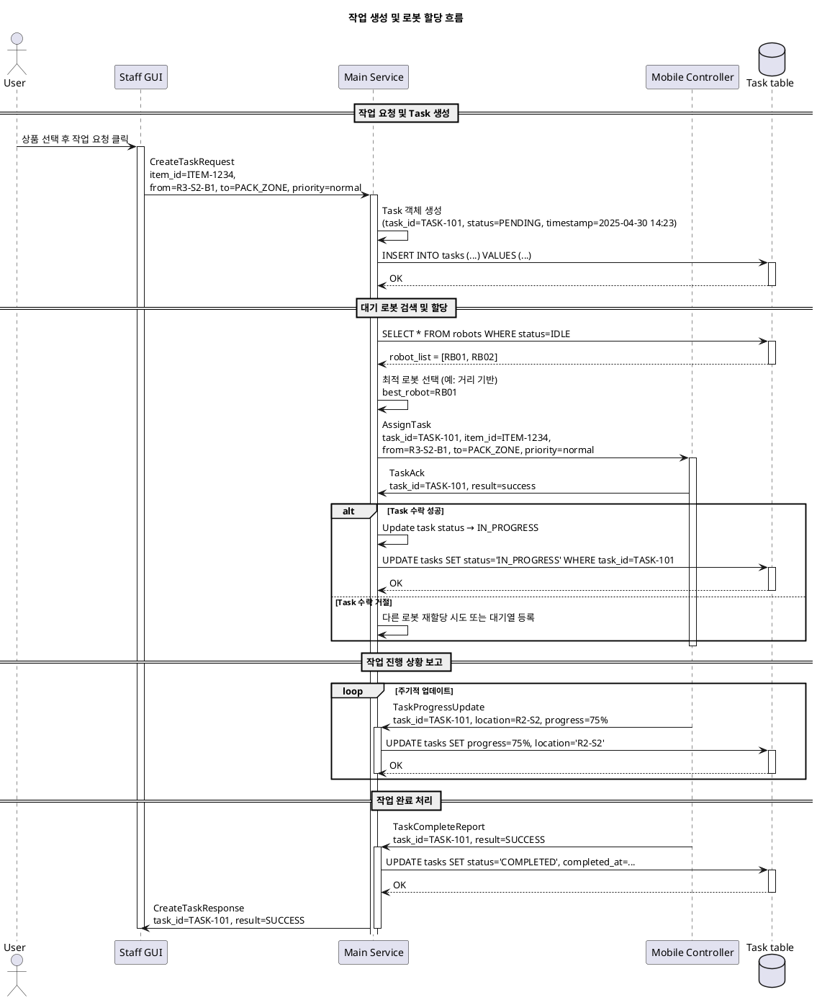
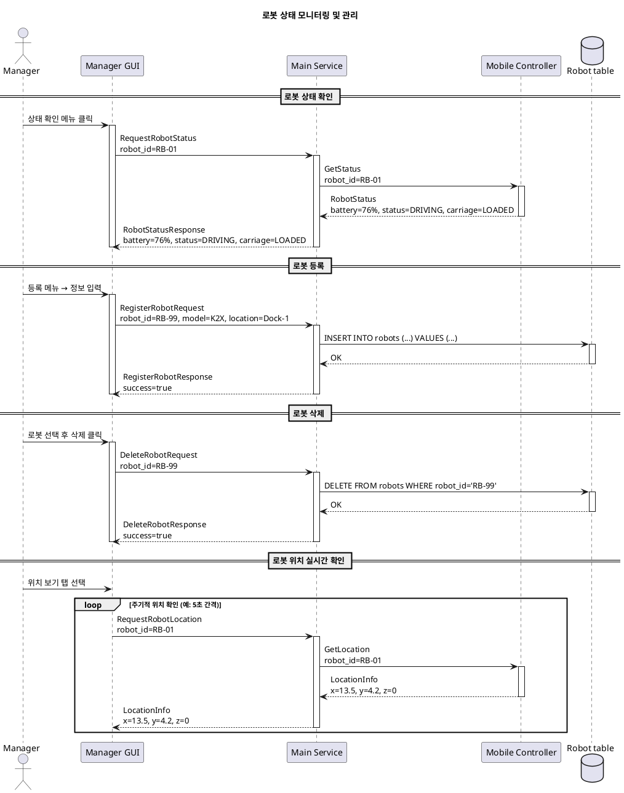
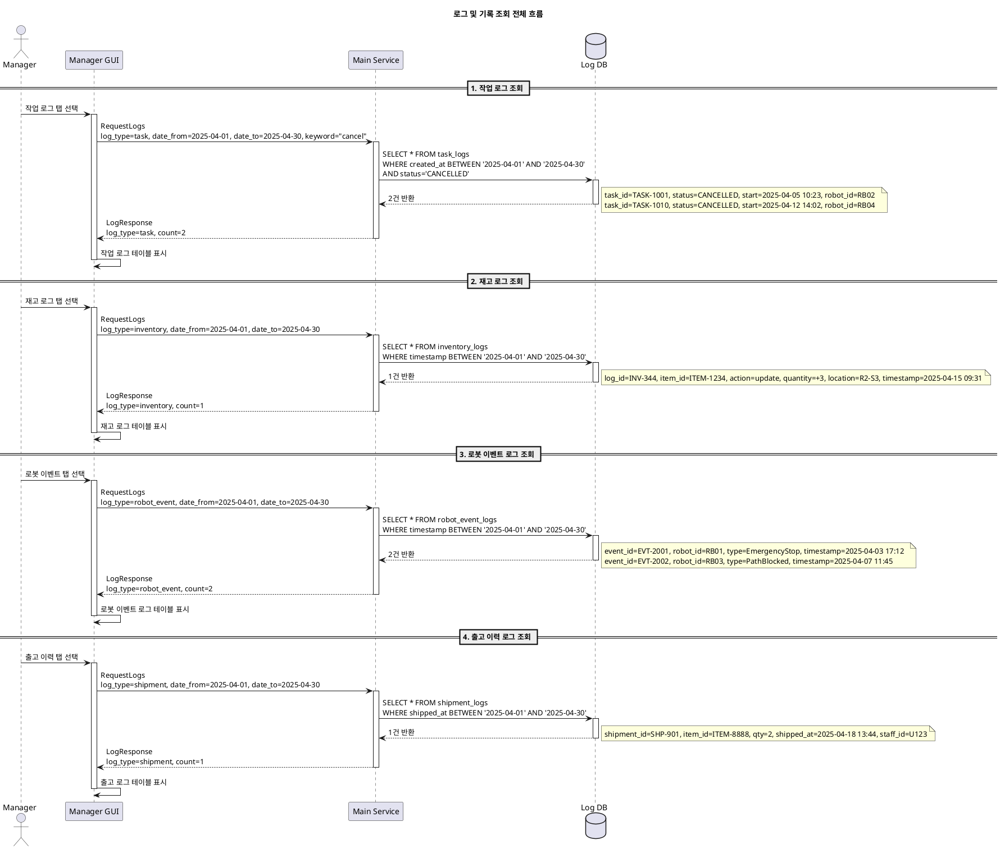
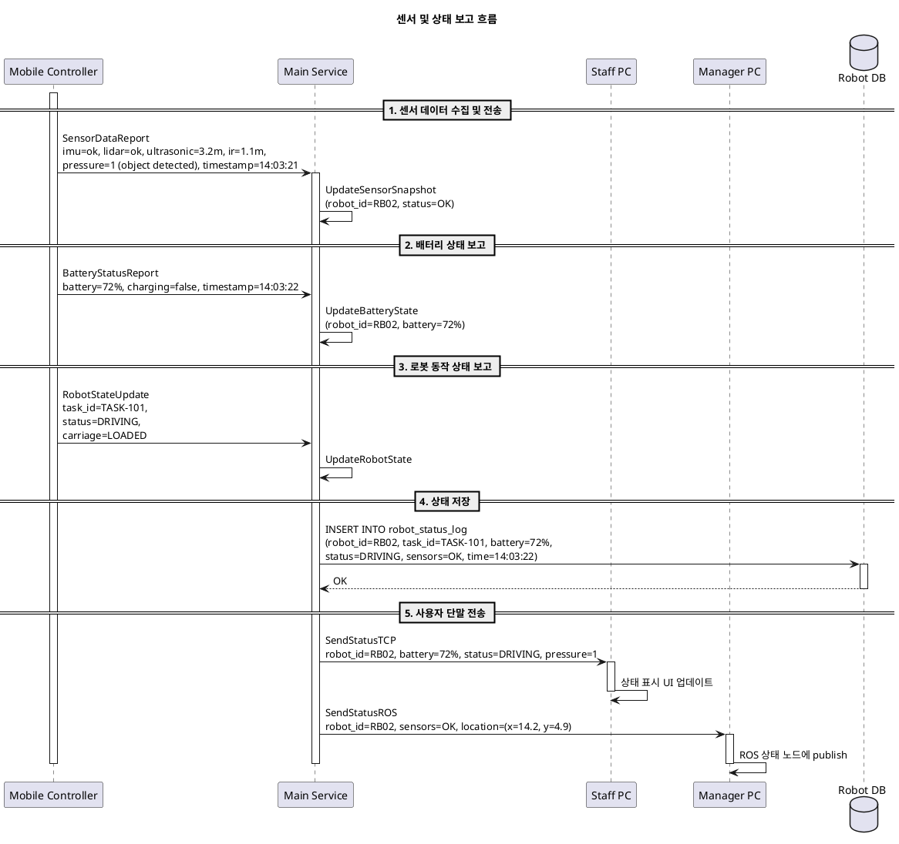
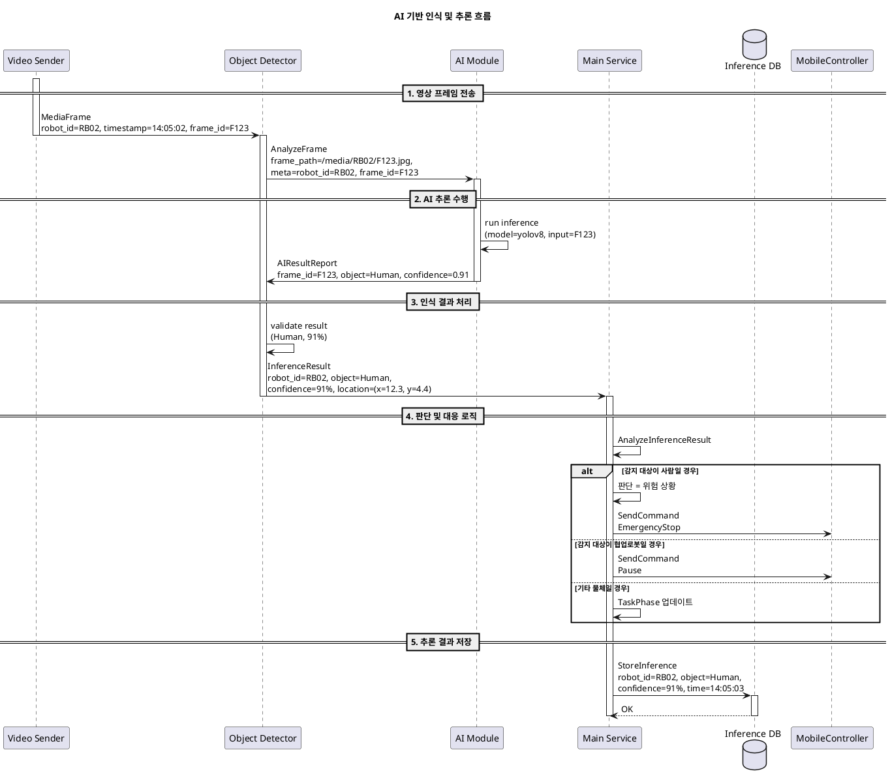
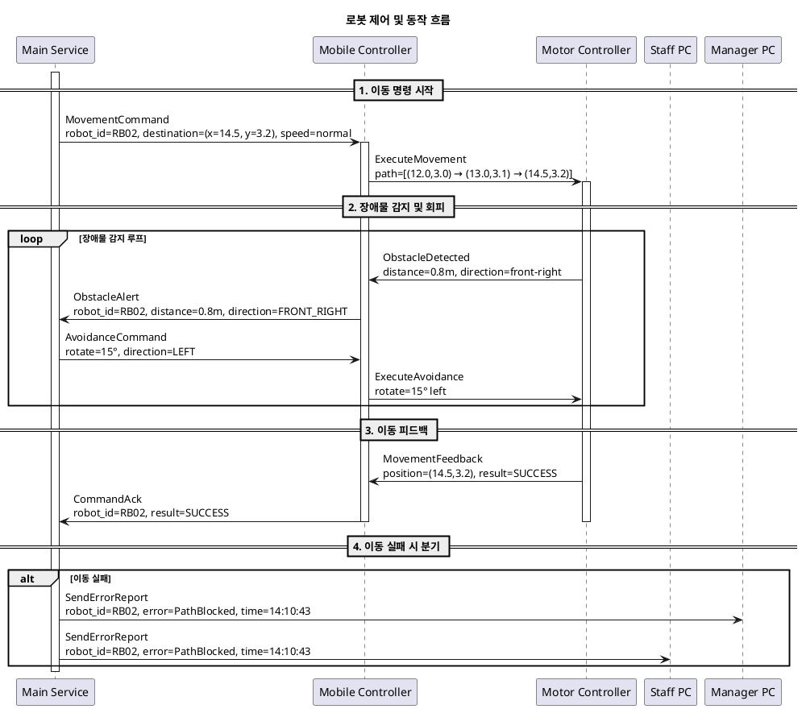

# 1. 사용자 단말 초기화 및 인증 (user_authentication)

---

# 2. 재고 조회 및 요청 (inventory_request_flow)

---

# 3. 작업 생성 및 로봇 할당 (task_assignment_flow)

---

# 4. 로봇 상태 모니터링 및 관리 (robot_monitoring_and_management)

---

# 5. 로그 및 기록 조회 흐름 (log_and_audit_flow)

---

# 6. 로봇 센서 및 상태 보고 흐름 (sensor_and_state_reporting)

---

# 7. AI 기반 인식 및 추론 흐름 (ai_perception_pipeline)

---

# 8. 로봇 제어 및 동작 흐름 (robot_control_and_motor_flow)

