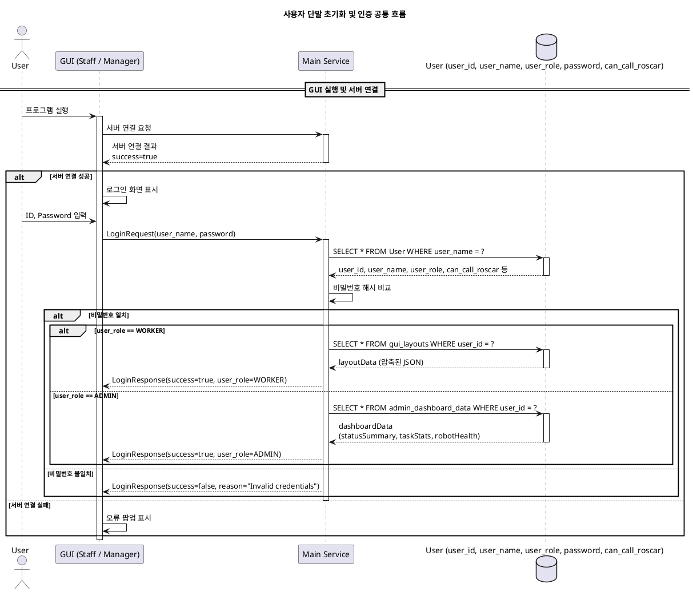
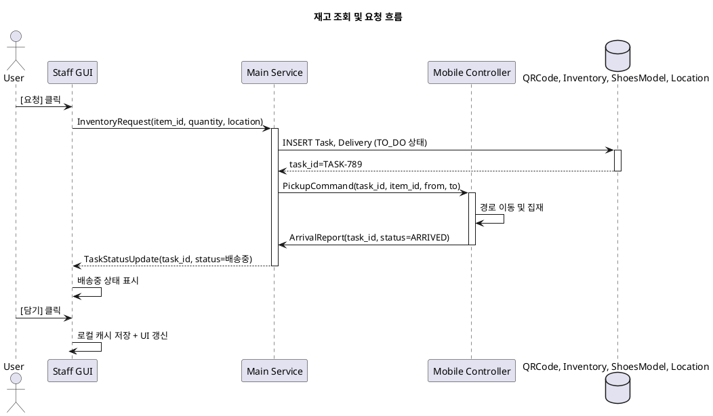
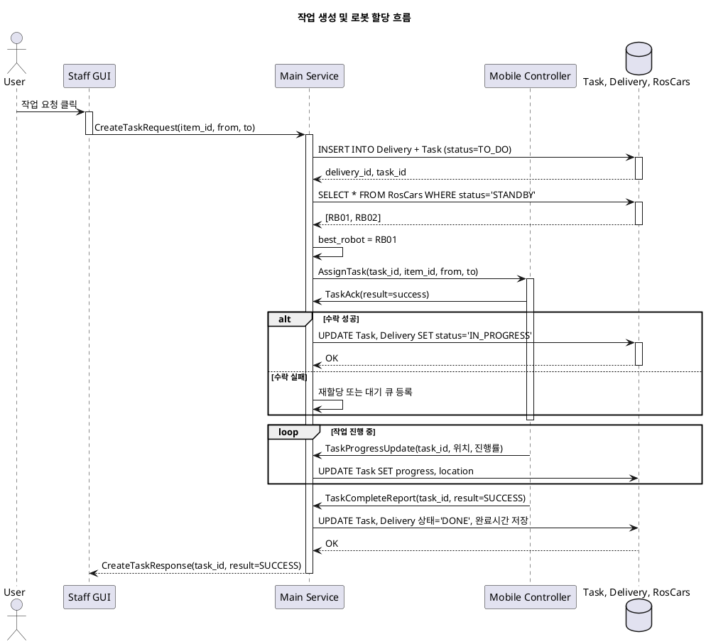
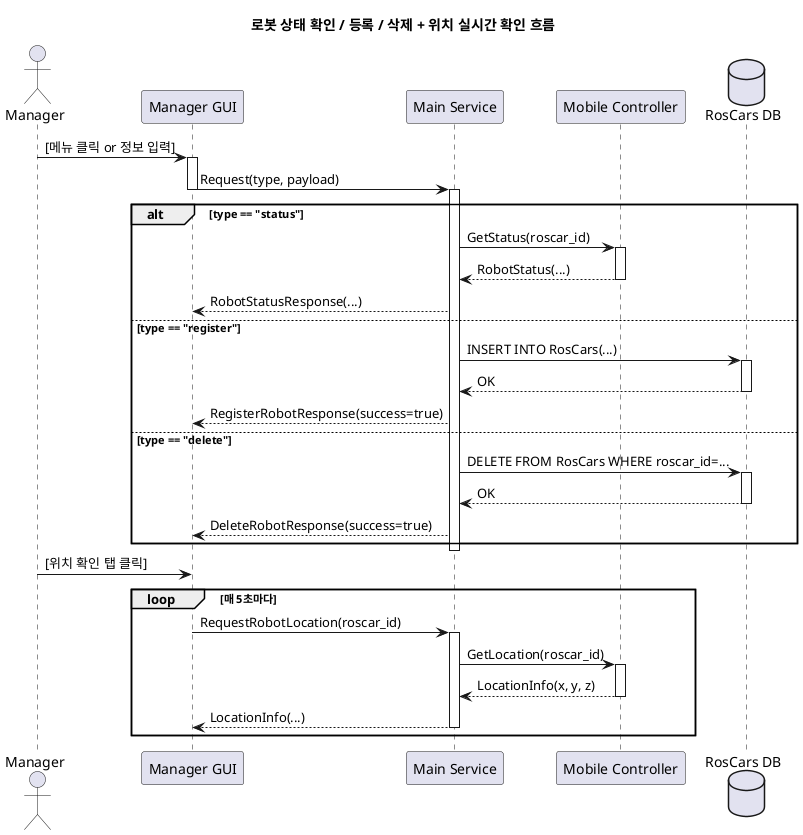
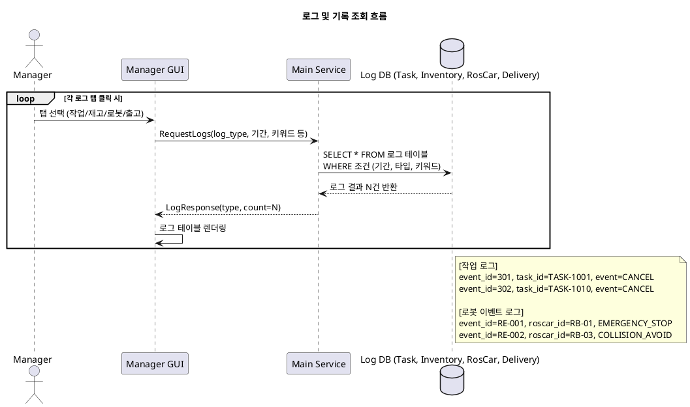
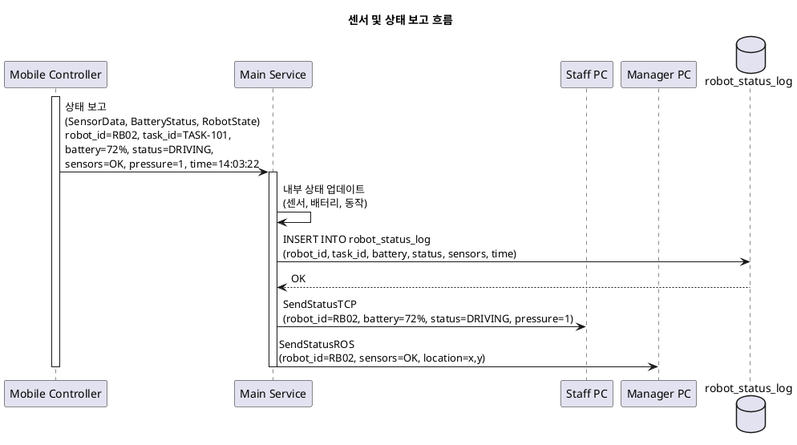
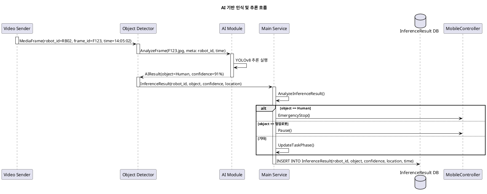
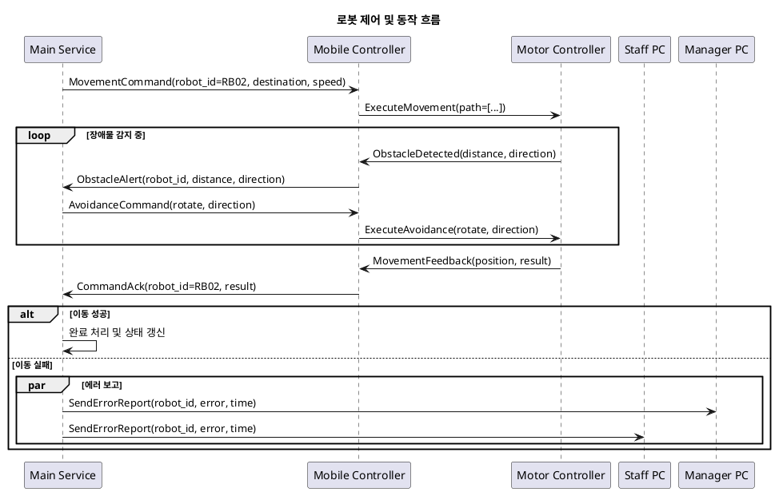
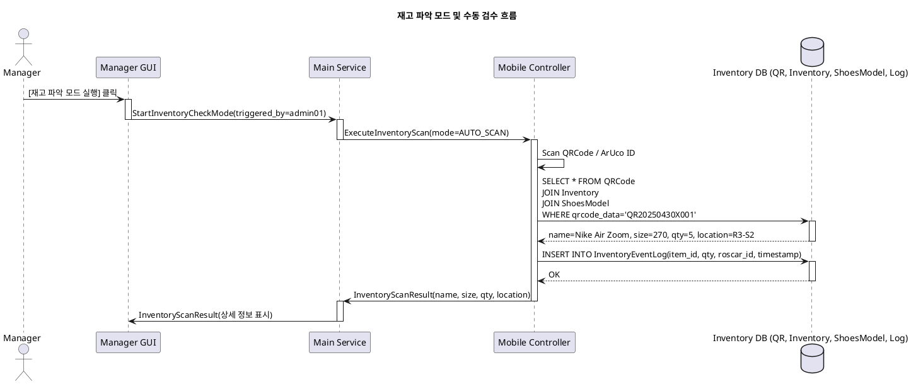

# 1. 사용자 단말 초기화 및 인증 (user_authentication)



---

# 2. 재고 조회 및 요청 (inventory_request_flow)

## 상품 정보 조회

```plantuml
title 재고 조회 및 요청 흐름

actor User
participant "Staff GUI" as Staff
participant "Main Service" as Main
database "QRCode, Inventory, ShoesModel, Location" as DB

User -> Staff : QR 스캔
activate Staff
Staff -> Staff : QR 파싱 → qrcode_data=QR20250430X001

Staff -> Main : SearchItemByQRCode(qrcode_data)
activate Main
Main -> DB : SELECT name, size, color, quantity, location\nFROM 조인된 테이블\nWHERE qrcode_data = ?
activate DB
DB --> Main : 상품 정보 반환\n(Nike Air Zoom, 270, black, 5, R3-S2-B1)
deactivate DB

Main --> Staff : SearchItemResponse(item, size, quantity, location)
deactivate Main

Staff -> Staff : GUI에 상품 정보 표시
```

## 상품 요청



---

# 3. 작업 생성 및 로봇 할당 (task_assignment_flow)



---

# 4. 로봇 상태 모니터링 및 관리 (robot_monitoring_and_management)



---

# 5. 로그 및 기록 조회 흐름 (log_and_audit_flow)



---

# 6. 로봇 센서 및 상태 보고 흐름 (sensor_and_state_reporting)



---

# 7. AI 기반 인식 및 추론 흐름 (ai_perception_pipeline)



---

# 8. 로봇 제어 및 동작 흐름 (robot_control_and_motor_flow)



# 9. 재고 파악 모드 및 수동 검수 기능 (inventory_verification_mode)

