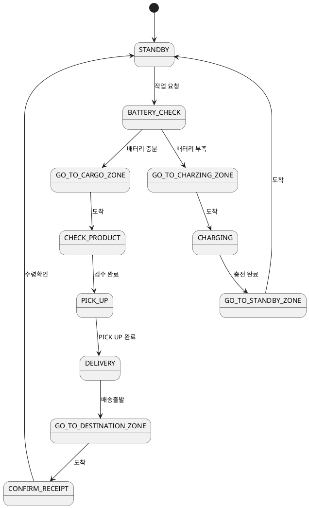

```plantuml
@startuml
[*] --> STANDBY

STANDBY --> BATTERY_CHECK : 작업 요청

BATTERY_CHECK --> GO_TO_CARGO_ZONE : 배터리 충분
BATTERY_CHECK --> GO_TO_CHARZING_ZONE : 배터리 부족

GO_TO_CARGO_ZONE --> CHECK_PRODUCT : 도착
CHECK_PRODUCT --> PICK_UP : 검수 완료
PICK_UP --> DELIVERY : PICK UP 완료
DELIVERY --> GO_TO_DESTINATION_ZONE : 배송출발
GO_TO_DESTINATION_ZONE --> CONFIRM_RECEIPT : 도착
CONFIRM_RECEIPT --> STANDBY : 수령확인

GO_TO_CHARZING_ZONE --> CHARGING : 도착
CHARGING --> GO_TO_STANDBY_ZONE : 충전 완료
GO_TO_STANDBY_ZONE --> STANDBY : 도착
@enduml
```